[](https://ci.appveyor.com/project/LiquidAssContainer/ahj-diploma)

# Дипломное задание к курсу «Продвинутый JavaScript в браузере». Chaos Organizer

[Heroku](https://ahj-diploma-chaos-organizer.herokuapp.com).

[Репозиторий с backend](https://github.com/LiquidAssContainer/ahj_diploma_backend).

Вёрстка и пользовательский опыт на удобоваримом уровне (для учебного проекта), со стороны бекенда есть какая-то базовая валидация, архитектура со стороны фронтенда не образцовая, но и не ужасная (о как). Акцент в первую очередь на аккуратности (в целом) и нормально работающем функционале. Адаптив не везде доработан. Критических багов не находил. Как-то так :)

Конечно, многие аспекты можно сделать куда лучше (например, оптимизация количества запросов к серверу...), но и времени на это ушло бы гораздо больше.

Ниже перечислены реализованные обязательные и дополнительные функции. Но в принципе и без дополнительного описания весь функционал должен быть очевиден и понятен.

## Обязательные функции

### Сохранение в истории ссылок и текстовых сообщений

Здесь всё просто и понятно. Надеюсь только, что не требовалось реализовать прикрепление ссылки как отдельной сущности.

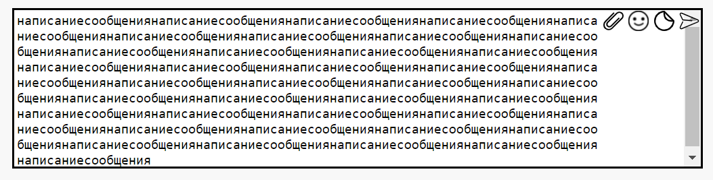

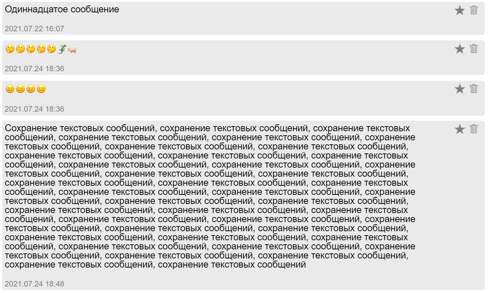

### Ссылки должны быть кликабельны и отображаться как ссылки

Реализовано со стороны фронтенда. Функция с помощью регулярного выражения находит подстроку, которая начинается с `http://` или `https://` и заканчивается пробелом/концом строки (или определённым символом перед пробелом/концом строки), и превращает её в кликабельную ссылку.

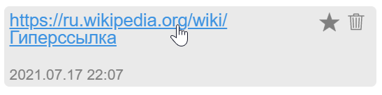

Конечно, моя регулярка не работает с абсолютно каждой ситуацией, кейсы с не совсем корректной работой этой функции я уже находил.

### Сохранение в истории изображений, видео и аудио

Одна из фич в моей работе — возможность загружать сразу множество файлов разных типов в одном сообщении (правда ограничения на количество файлов вообще нет ¯\\\_(ツ)\_/¯ ).

Загрузка файлов возможна через всплывающее меню в форме для нового сообщения.

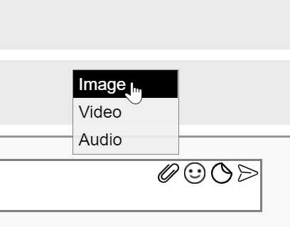

Также можно перетащить файл из операционной системы, окошко для загрузки появляется автоматически.

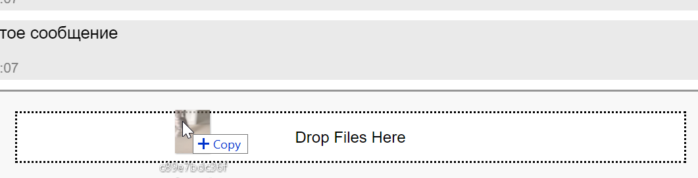

Для всех загруженных файлов есть простенькое превью с кнопкой для удаления файла.

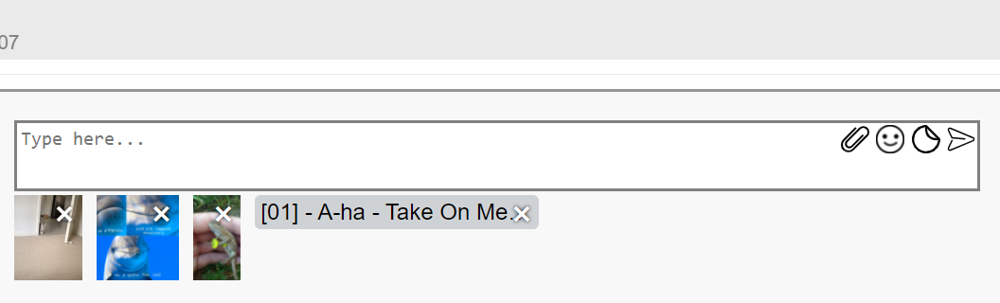

<!--  -->

Можно было бы добавить загрузку вообще любых файлов (тогда непредусмотренные типы загружались бы просто в виде файла), но руки не дошли. Если пользователь попытается загрузить файл неподдерживаемого типа через инпуты или Drag & Drop, то сработает валидация и в итоге ничего не произойдёт.

### Скачивание файлов (на компьютер пользователя)

Скачивание происходит путём нажатия на соответствующую кнопку:

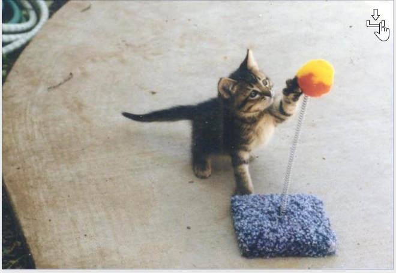


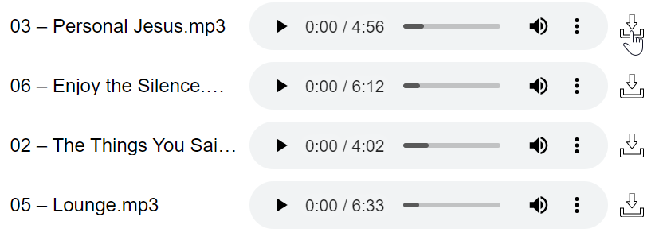

### Ленивая подгрузка

Ленивая подгрузка реализована для всех вкладок (все сообщения, избранное, изображения и т. д.), кроме результатов поиска по ключевым словам: при поиске отображаются сразу все найденные сообщения.

## Дополнительные функции

### Поиск по сообщениям (сервер)

Инпут для поиска сообщений по тексту находится вверху сайта.

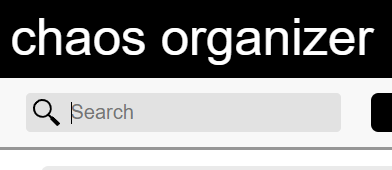

Поиск идёт по законченному слову, находятся только полностью идентичные подстроки (без склонения и прочего).

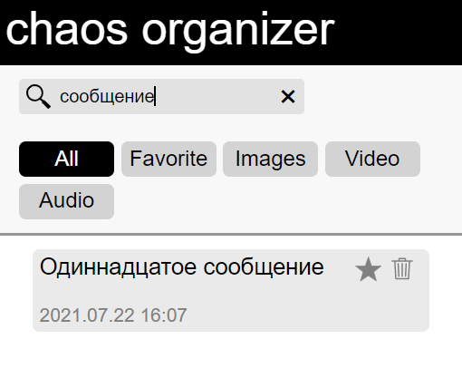

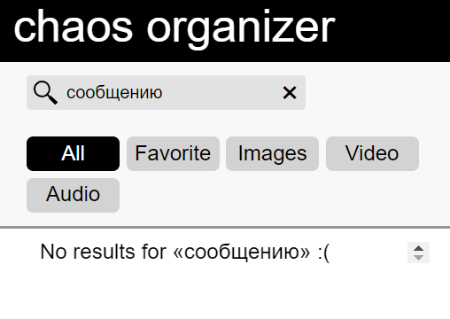

### Воспроизведение видео/аудио (используя API браузера)

Реализовано при помощи тегов `<video>` и `<audio>` с атрибутом `controls`. На самом деле очень простая фича, тут особо нечего описывать.

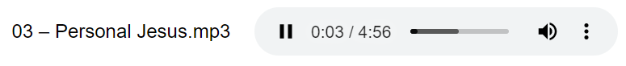


### Добавление сообщения в избранное

Тоже достаточно простая фича. У каждого сообщения есть кнопка в виде звёздочки для добавления/удаления из избранного. Вкладка для просмотра избранных сообщений (**Favorite**) находится сверху.

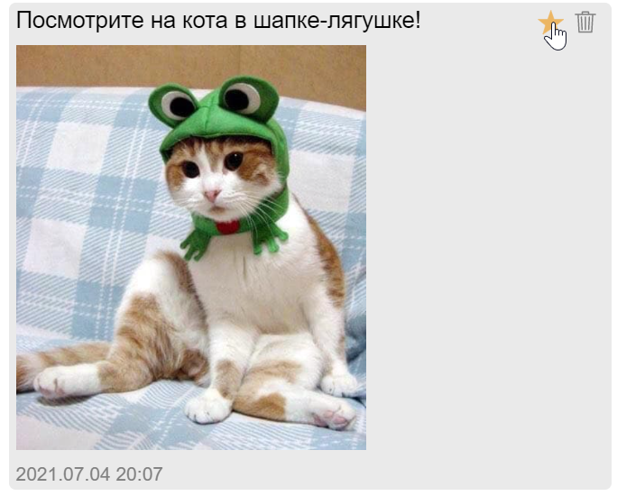

### Просмотр вложений по категориям

Категорию можно выбрать вверху сайта, пример с просмотром всех изображений:

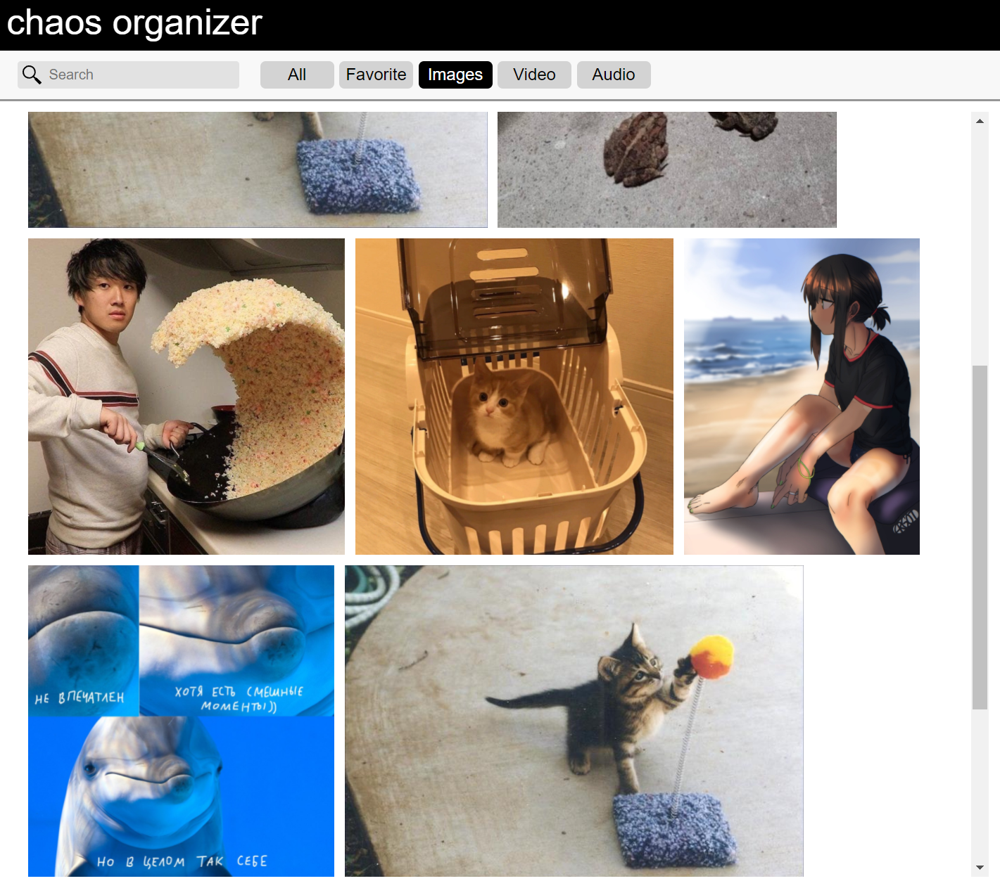

### Поддержка смайликов (emoji)

В форме для написания нового сообщения есть кнопка с открывающейся панелью с эмодзи. Можно было бы ограничиться таким вот селектом, выводя обычные юникодовские эмодзи и никак их не обрабатывая, но это слишком просто для дополнительной фичи. Поэтому в панели выбора эмодзи и в списке сообщений (если эмодзи были предварительно добавлены) отображаются эмодзи с кастомными изображениями. Юникодовские символы превращаются в изображения при помощи регулярки.

Селект:

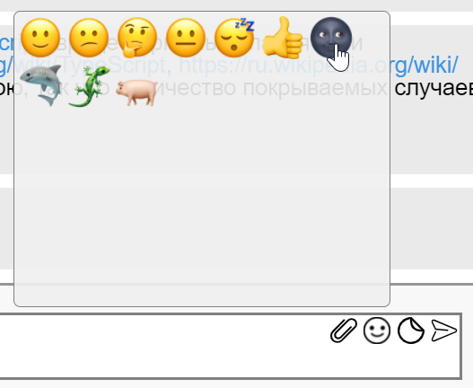

В textarea:

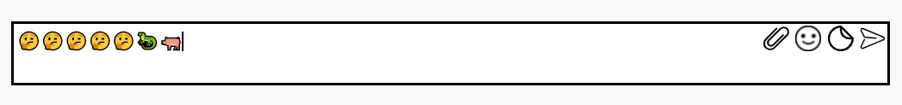

В списке сообщений:

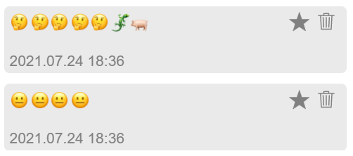

Было бы круто сделать эмодзи в виде изображений и в `textarea` (`div` с `contenteditable`), но там были свои нюансы, так что я решил отказаться от этой идеи.

### Поддержка стикеров

Здесь тоже используется открывающаяся панель, как с эмодзи. При нажатии на нужный стикер происходит отправка сообщения с типом sticker. Всего у меня два стикерпака. Единственный минус — стикеры у меня мало чем отличаются от обычных изображений.

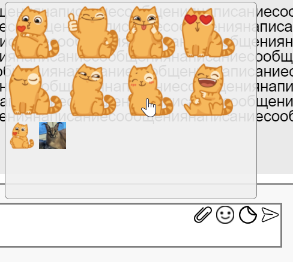

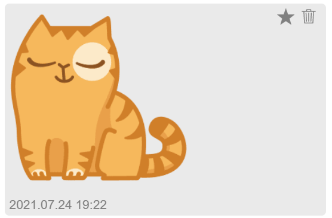

### Поддержка оформления кода

Реализовано при помощи библиотеки highlight.js. Поддерживает как инлайновый кусок кода (\`hello world\`), так и блочный кусок:

<pre>
```
console.log(1 + 2 + 3);
console.log('abc');
```
</pre>

Как это выглядит:

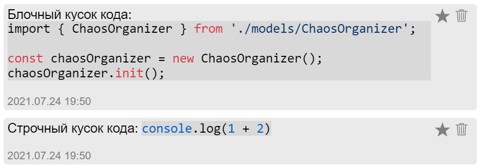

Язык программирования автоматически определяется библиотекой, так что она не всегда будет корректно распознавать. А ещё у меня не стоит вставлять эмодзи в кусок кода, т. к. эмодзи превращаются в изображения 🤔

## Прочие функции

### Модальное окно для просмотра изображений

Нажав на любое изображение (кроме каких-нибудь стикеров разве что), пользователь откроет модальное окно для более детального просмотра:

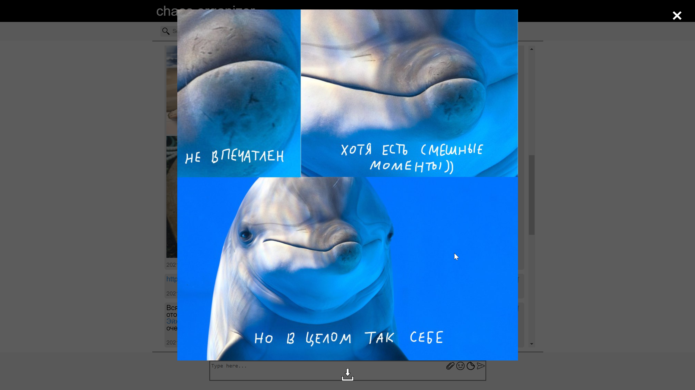
